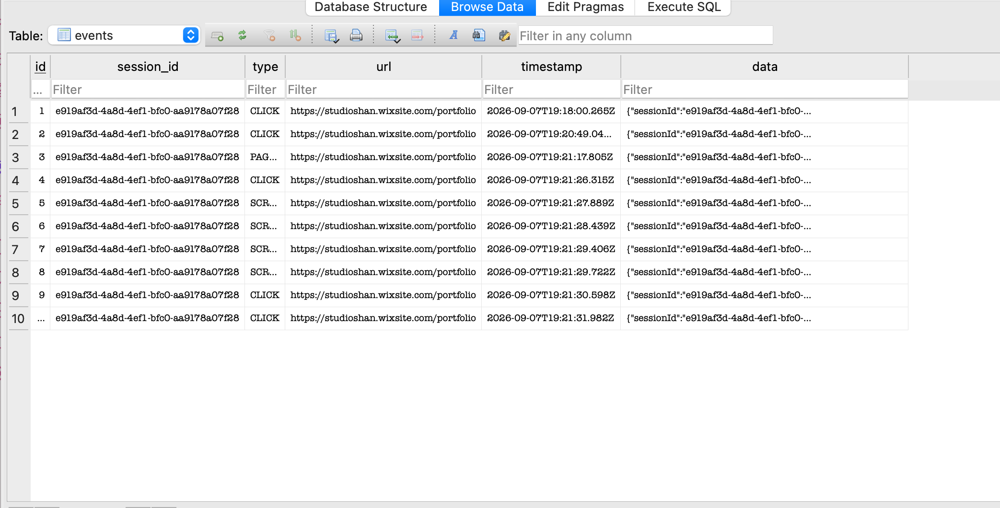

# Lab Notes
### Research & Links
- https://developer.mozilla.org/en-US/docs/Mozilla/Add-ons/WebExtensions/Safely_inserting_external_content_into_a_page

### Progress (as of 9/8)
I developed a tracking script (`tracker.js`) that collects user interaction data such as clicks, page views, scrolling behavior, and navigation. I initially tested the script locally on my own websites and verified that it could successfully track interactions. I then tested the script on a separate website from the application where it was originally developed. This demonstrated that the tracker could be injected into and run on an external website rather than being limited to the application it was created for.

Building on this, I developed a Chrome browser extension that allows a user to enter a target website and inject the tracking script into that site. I successfully tested the extension on both a basic external website and my personal Wix portfolio, where the tracker was able to detect real user interactions, including clicks, scrolling, and navigation between pages. This was an important proof of concept for the project, as it demonstrated that the platform can potentially collect usability data from websites without requiring the researcher to modify the website's source code.

After confirming that the extension could successfully collect tracking data, I developed an Express backend to receive the events generated by the tracker. I created an API endpoint that accepts the tracking data through POST requests and successfully verified that events from the external website were being received by the backend. I then connected the backend to a SQLite database and created an events table to store the collected data. I tested the complete process by interacting with my portfolio website and confirmed that events such as clicks, scrolling, and page views were successfully stored in the database. This established the full data pipeline from an external website, through the browser extension and tracking script, to the backend and database.

I then created a `studies` table which contains information such as the study name, target website URL, and creation date. Along with this, I created an `/api/studies` endpoint that allows a new study to be created and assigned a unique study ID. 

Most recently - I connected participant events to studies and sessions. I added a study_id field to the events table so that each interaction would be associated to the correct study. I also created a `sessions` table containing the study ID, a unique participant session ID, and the session start and end times. I successfully tested this connection and confirmed that events can be associated with both a specific study and participant session. 

My next steps are to add tasks that the participants can complete during a study. I then want to start developing the frontend researcher dashboard to start organizing and displaying useful data that I am collecting.

### Next Steps 
Start building the researchers dashboard -- how I can add hard data and analytics in a report, graphs etc. Evaluate my website and generate some report for the user. 
Fix the architecture so its request response. Push participant and researcher together. 
