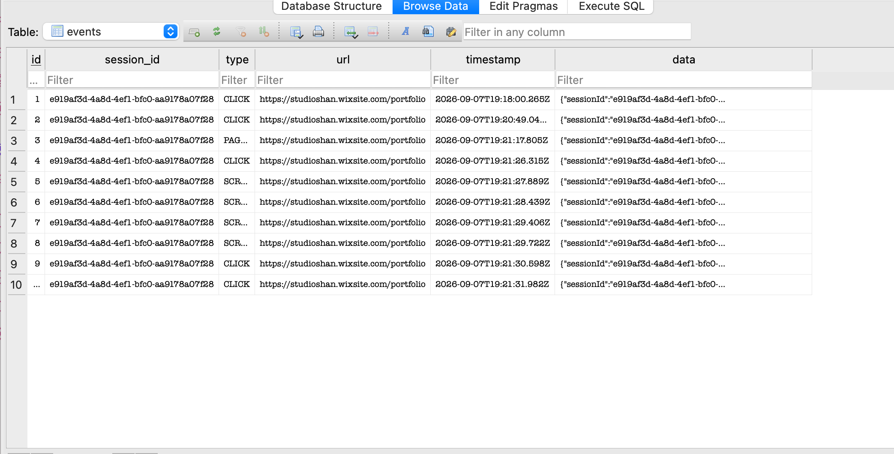

# Lab Notes
### Research & Links
- https://developer.mozilla.org/en-US/docs/Mozilla/Add-ons/WebExtensions/Safely_inserting_external_content_into_a_page
- https://recharts.github.io/en-US/guide/

### Progress Update 9/8
I developed a tracking script (`tracker.js`) that collects user interaction data such as clicks, page views, scrolling behavior, and navigation. I initially tested the script locally on my own websites and verified that it could successfully track interactions. I then tested the script on a separate website from the application where it was originally developed. This demonstrated that the tracker could be injected into and run on an external website rather than being limited to the application it was created for.

Building on this, I developed a Chrome browser extension that allows a user to enter a target website and inject the tracking script into that site. I successfully tested the extension on both a basic external website and my personal Wix portfolio, where the tracker was able to detect real user interactions, including clicks, scrolling, and navigation between pages. This was an important proof of concept for the project, as it demonstrated that the platform can potentially collect usability data from websites without requiring the researcher to modify the website's source code.

After confirming that the extension could successfully collect tracking data, I developed an Express backend to receive the events generated by the tracker. I created an API endpoint that accepts the tracking data through POST requests and successfully verified that events from the external website were being received by the backend. I then connected the backend to a SQLite database and created an events table to store the collected data. I tested the complete process by interacting with my portfolio website and confirmed that events such as clicks, scrolling, and page views were successfully stored in the database. This established the full data pipeline from an external website, through the browser extension and tracking script, to the backend and database.

I then created a `studies` table which contains information such as the study name, target website URL, and creation date. Along with this, I created an `/api/studies` endpoint that allows a new study to be created and assigned a unique study ID. 

Most recently - I connected participant events to studies and sessions. I added a study_id field to the events table so that each interaction would be associated to the correct study. I also created a `sessions` table containing the study ID, a unique participant session ID, and the session start and end times. I successfully tested this connection and confirmed that events can be associated with both a specific study and participant session. 

### Progress Update 9/15 

My progress this week consisted of adding a dashboard for the researcher that displays data from participant sessions. I wanted to ensure that I could make a useful area where users could see the analytics from their website. I added many sections to the dashboard, including participant count, total events, page views, clicks, scroll events, and the study website. I also added an Event Activity graph to visualize participant interactions over time.

To make the analytics more useful for UX researchers, I added visualizations for most clicked elements and scroll depth. The most clicked elements show which parts of the website participants interact with most frequently, while the scroll depth visualization shows how many participants reached different points on the page.

All of this data is gathered from the backend and SQLite Database, allowing it to display analytics from actual usability tests. 

I also implemented different studyIds so researchers can switch between multiple studies easily and see different data for each, separately.

The current system can therefore collect participant interactions from an external website, store the data in SQLite, process the data through the backend, and present the results in a researcher-facing dashboard.

Next, I want to start working on the participant dashboard. I'm still having some issues with separating different studies and I think the next step should be developing a way to generate different participant links so I don't have to hardcode the studyID. 

### Progress Update 9/22

This week I focused on enhancing the researcher dashboard that I created last week. I added a heatmap, allowing researchers to see where clicks are being made on their website. To ensure that researchers see their website in the background, I used playwright, a browser automation library, to take a screenshot of the homepage upon creating a study. I need to refine this as it looks like it may have been taking screenshots before some websites fully loaded. 

Additionally, I added a feature to create a new study from the researcher dashboard. Upon creating a new study, a studyID is automatically assigned and a participant URL is generating including that studyID. This made it simple to remove the previously hardcoded studyID and instead have it be dynamic, so the backend reads the studyID from the URL the participant uses. Therefore, there is no longer any mix of the data between different studies that I was struggling with before. 

I also added the beginnings of a participant frontend, showing the invitation to complete a study and a link to go to the participant URL. 

Next, I want to add login and validation for the researcher, and refine the heatmaps. I want to continue refining the researcher dashboard and ensure all data is clear. I also want to finish up the participant frontend and add tasks to each study. 

### Progress Update 9/26
I implemented a proxy system that allows the platform to load an external website through the usability testing platform. When a participant accesses their unique testing link, the platform retrieves the study’s target website and serves it through the proxy. The proxy also injects the tracking script into the website, allowing participant interactions such as clicks, page views, and scrolling to be recorded automatically. This replaces the need for the previous Chrome extension approach and creates a more seamless testing experience for participants.

Currently I am using Cloudflare Tunnel to host my locally hosted Express backend on the internet during development. This allows participants to access the testing platform and allows the injected tracking script to communicate with my backend, even though the server is running locally. Eventually I want to host my project on the servers at New Paltz as Cloudflare is for temporary use. 

I also added a participant task popup that appears directly on the testing website, providing instructions during the usability test. This was also done by injecting the popup code into the proxy. 

In the researcher dashboard, I added the feature where participant links could be generated for individual studies. Each link is assigned a unique token to identify the study and participant session. This allows researchers to distribute study-specific testing links without requiring participants to install a browser extension.

Lastly I also added a feedback form for participants after finishing the usability test. The feedback, along with task completion rates, are stored and connected to the participant's study and session. I added this data into the researcher dashboard so researchers could easily view user pain points and other feedback. 

### Next Steps 
Adding login and validation?
Making tasks dynamic - when researcher creates a new study they can put in tasks for participant to complete 

